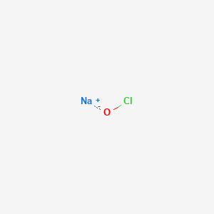

NaOCl (Sodium Hypochlorite)

### Chemical formula    NaOCl
### Molar mass  74.442 g/mol
### Appearance  
White crystalline solid (anhydrous);
Colorless or slightly yellow  or greenish-yellow crystalline solid (pentahydrate)
### Odor    Chlorine-like and sweetish (pentahydrate)
### Density 1.11 g/cm3
### Melting point   18 °C (64 °F; 291 K) (pentahydrate)
### Boiling point   101 °C (214 °F; 374 K) (decomposes) (pentahydrate)
### Solubility in water 29.3 g/(100 mL) (0 °C)
### Acidity (pKa)   7.5185
### Basicity (pKb)  6.4815

| Cleaning and safety |

| Cleaning products and household care \-\> air freshener |

| Cleaning products and household care \-\> bathroom \-\> bathroom cleaner |

| Cleaning products and household care \-\> dishwasher and dishes \-\> automatic dishwashing detergent |

| Cleaning products and household care \-\> drain products |

| Cleaning products and household care \-\> general household cleaning |

| Cleaning products and household care \-\> general household cleaning \-\> bleach |

| Cleaning products and household care \-\> general household cleaning \-\> disinfectant |

| Cleaning products and household care \-\> general household cleaning \-\> surface cleaner |

| Cleaning products and household care \-\> laundry and fabric treatment \-\> laundry detergent |

| Cleaning products and household care \-\> laundry and fabric treatment \-\> laundry stain remover |

| Home maintenance \-\> paint/stain and related products \-\> paint |

| Home maintenance \-\> paint/stain and related products \-\> stripper |

| Landscape/yard \-\> pool chemicals \-\> chlorine and bromine |

| Personal care \-\> hair styling and care \-\> hair conditioner |

| Personal care \-\> make-up and related |

| Raw materials |

| Sports equipment \-\> skiing |

| Vehicle \-\> boat care and maintenance \-\> boat cleaner \- general |

| active ingredient |

| active ingredient, cleaning agent, bleaching agent, whitening agent |

| antimicrobial active |

| biocide |

| bleach |

| bleach precursor |

| bleaching agent |

| bleaching agent |

| bleaching-oxidizing agent |

| chemical reaction modifier |

| oxidizing agent |

| prevents spotting |

| process aid |

* Used as a disinfectant and bleaching agent with applications in the chemical, paper, textile, water treatment, and dairy industries; it is used to disinfectant water in swimming pools and cooling towers of power plants. \[HSDB\] 5% solution used as a hypo eliminator in photo development; \[www.ci.tucson.az.us/arthazards/medium.html\] Used in the EU on mushroom crops; Also used in the paint, lime, glass, pharmaceutical, metal (detoxify cyanide baths), and synthetics industries  
* Electroplating   
* Petroleum Production and Refining   
* Pulp and Paper Processing   
* Textiles (Fiber & Fabric Manufacturing)   
* Using Disinfectants or Biocides   
* Sewer and Wastewater Treatment   
* Photographic Processing   
* Textiles (Printing, Dyeing, or Finishing)   
* Farming (Respiratory Hazards)   
* Glass Manufacturing   
* Metal Extraction and Refining   
* Textile arts  
* For Sodium hypochlorite (USEPA/OPP Pesticide Code: 014703\) ACTIVE products with label matches. /SRP: Registered for use in the U.S. but approved pesticide uses may change periodically and so federal, state and local authorities must be consulted for currently approved uses./  
* Bleaching agent; household & laundry bleaching agent; bleaching agent in paper, pulp, textile indust; disinfectant for glass, ceramics & water; algicide & molluscicide in cooling water for power stations; bleach in alpha-olefin sulfonate production, reactant in hydrazine mfr  
* In dairies for disinfecting utensils and apparatus. /Sodium hypochlorite soln/  
* Anti-infective (topical) /sodium hypochlorite soln/  
* Sodium hypochlorite is frequently used as a disinfectant or a bleaching agent.

## Methods of Manufacturing

* Sanfourche, Gardent, Bull Soc Chim (4) 35, 1089 (1924); Schmeisser in Handbook of Preparative Inorganic Chemistry Vol 1, G Brauer, ed (Academic Press, NY, 2nd ed, 1963\) pp 309-310. Anhydrous sodium hypochlorite may be obtained by freeze-drying in vacuum (over concn sulfuric acid). Addition of chlorine to cold dilute solution of sodium hydroxide.  
* Soln of sodium hypochlorite containing 0.45-0.50 g of the salt in 100 ml. Prepd by diluting with distilled water a soln of sodium hypochlorite, adding a 5% soln of sodium bicarbonate, nad adjusting to proper strength and concn according to procedure described in N.F. May be prepared also from 15.4 g chlorinated lime (30% available chlorine), 7.7 g anhydrous sodium carbonate, and 6.4 g sodium bicarbonate per liter; this soln is then adjusted ... /Sodium hypochlorite soln, diluted/