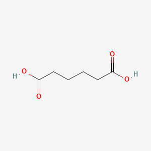

Adipic Acid

### Chemical formula    C6H10O4
### Molar mass  146.142 g·mol−1
### Appearance:  White crystals ; Monoclinic prisms
### Odor:   Odorless
### Density 1.360 g/cm3
### Melting point   152.1 °C (305.8 °F; 425.2 K)
### Boiling point   337.5 °C (639.5 °F; 610.6 K)
### Solubility in water 14 g/L (10 °C), 24 g/L (25 °C), 1600 g/L (100 °C)
### Solubility:  Very soluble in methanol, ethanol ; soluble in acetone, acetic acid ; slightly soluble in cyclohexane ; negligible in benzene, petroleum ether
### Vapor pressure:  0.097 hPa (18.5 °C) = 0.073 mmHg
### Acidity (pKa):   4.43, 5.41
### Conjugate base:  Adipate

| Arts and crafts/office supplies \-\> children's art and toys \-\> crayons |

| Personal care \-\> facial cleansing and moisturizing \-\> face mask |

| Personal care \-\> hair styling and care \-\> hair conditioner |

| Personal care \-\> hair styling and care \-\> hair spray |

| Personal care \-\> hair styling and care \-\> shampoo |

| Personal care \-\> make-up and related \-\> eye liner |

| Personal care \-\> make-up and related \-\> foundation/concealer |

| Personal care \-\> make-up and related \-\> lip balm |

| Personal care \-\> sunscreen |

| Raw materials |
| backing |
| buffering |
| flavouring |
| fragrance ingredient |
| masking |
| miscellaneous |
| pH regulating agent |
| ph adjuster |
| processing aids and additives Lubricants and lubricant additives Solvents (for cleaning or degreasing) Plasticizers Solvents (which become part of product formulation or mixture) Intermediate Adsorbents and absorbents Intermediates Flocculating agent Processing aids not otherwise specified Monomers Flotation agent Solids separation agents Catalyst |

* Used to make nylon, polyurethane foams, lubricants, and plasticizers; Used in adhesives, baking powder, and food flavoring  
* The major markets for adipic acid include use as feedstocks for nylon 6,6 resins and fibers, polyester polyols and plasticzers.  
* Applications documented for adipic acid are as a lubricant additive in coatings, and foams, and in shoe soles, as tanning agent in leather industry, pH regulator in processes such as in the production of cleaning agents, pelletizing agent in disinfectant pills for drinking water, additive in flue gas sulfurization, in the coating of dishwashing machine tablets and as an additive in chemicals  
* As an acidulant in dry powdered food mixtures, especially in those products having delicate flavors & where addition of a tang to the flavor is undesirable.  
* addition to foods imparts a smooth, tart taste. In grape-flavored products, it adds a lingering supplementary flavor and gives an excellent set to food powders containing gelatin ... For concentrations /of adipic acid ranging/ from 0.5-2.4 g/100 mL, the pH ... varies less than half a unit. ... pH is low enough to inhibit browning of most fruits and other foodstuffs.  
* 

## Methods of Manufacturing

* Commercially important processes ... employ two major reaction stages. The first reaction stage is the production of the intermediates cyclohexanone and cyclohexanol, usually abbreviated as KA, KA oil, ol-one, or anone-anol. The KA (ketone, alcohol), after separation from unreacted cyclohexane (which is recycled) and reaction by-products, is then converted to adipic acid by oxidation with nitric acid.  
* Two companies Verdezyne and Rennovia are developing bio-based adipic acid production. Verdezyne uses genetically modified enzymes to ferment glucose to adipic acid. ... Rennovia uses air oxidation to convert glucose to glucaric acid, followed by hydrodeoxygenation to convert glucaric acid to adipic acid.  
* Oxidation of cyclohexane, cyclohexanol, or cyclohexanone with air or nitric acid.