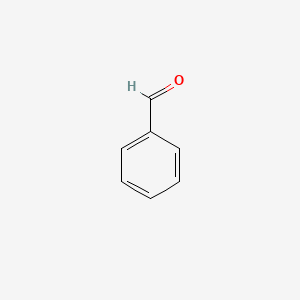
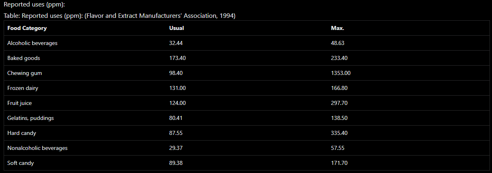

Benzaldehyde

### Chemical formula    C7H6O
### Molar mass  106.124 g·mol−1
### Appearance  colorless liquid
### strongly refractive
### Odor:    almond-like
### Density: 1.044 g/mL, liquid
### Melting point:  −57.12 °C (−70.82 °F; 216.03 K)
### Boiling point:   178.1 °C (352.6 °F; 451.2 K)
### Solubility in water: 6.95 g/L (25 °C)

| Cleaning products and household care \-\> air freshener |

| Home maintenance \-\> degreaser |

| Personal care \-\> make-up and related |

| Personal care \-\> make-up and related \-\> lip gloss |

| Vehicle \-\> car interior \-\> auto air freshener |

| denaturant |

| finish |

| flavoring agent |

| flavoring and nutrient |

| flavouring |

| fragrance ingredient |

| masking |

| perfuming |

| solvent |

* Used as a chemical intermediate and a solvent for resins and oils; \[HSDB\] Used as a flavoring agent in food and perfume additive (FDA-approved)  
* The single largest use for benzaldehyde ... is the production of benzyl alcohol via hydrogenation.  
* Benzaldehyde is an aromatic aldehyde used in cosmetics as a denaturant, a flavoring agent, and as a fragrance. Currently used in only seven cosmetic products, its highest reported concentration of use was 0.5% in perfumes.  
* The compound is responsible for the odor of natural bitter almond oil and is incorporated directly in perfumes, soaps, foods, drinks, and other products. Substantial amounts are used in the production of derivatives that are also employed in the perfume and flavor industries.  
* Another application of benzaldehyde is the production of triphenylmethane dyes. ... In the pharmaceutical industry benzaldehyde is used as an intermediate in the manufacture of chloramphenicol, ephedrin, ampicillin, diphenylhydantoin, and other products.  
* Benzoic acid and a wide range of derivatives and related benzenic compounds, such as ... benzaldehyde ... , are commonly used as antibacterial and antifungal preservatives and as flavoring agents in food, cosmetic, hygiene, and pharmaceutical products. ...  
* Chemical intermediate for dyes, flavoring materials, perfumes, and aromatic alcohols; solvent for oils, resins, some cellulose ethers, cellulose acetate and nitrate; flavoring compounds; synthetic perfumes; manufacturing of cinnamic acid, benzoic acid; pharmaceuticals; photographic chemicals.  
*   
##  Methods of Manufacturing

* The air oxidation of toluene is the source of the majority of the world's synthetic benzaldehyde. Both vapor- and liquid-phase air oxidation processes have been used. In the vapor-phase process, a mixture of air and toluene vapor is passed over a catalyst consisting of the oxides of uranium, molybdenum, or related metals. High temperatures and short contact times are essential to maximize yields. Small amounts of copper oxide may be added to the catalyst mixture to reduce formation of by-product maleic anhydride. Conversion per pass is reported to be low, 10-20%, with equally low yields, 30-50%. The vapor-phase oxidation of toluene was the dominant toluene oxidation process in the 1950s and early 1960s, but is no longer of industrial importance. The liquid-phase process now dominates. In the liquid-phase process, both benzaldehyde and benzoic acid are recovered. This process was introduced and developed in the late 1950s by the Dow Chemical Company, as a part of their toluene-to-phenol process, and by Snia Viscosa for their toluene-to-caprolactam process. The benzaldehyde recovered from the liquid-phase air oxidation of toluene may be purified by either batch or continuous distillation.  
* Benzaldehyde is produced principally by the hydrolysis of benzal chloride or the partial oxidation of toluene.  
* Made synthetically from benzal chloride and lime or by oxidation of toluene.