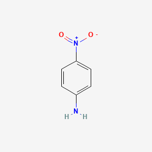

4-NitroAniline  
      
### Chemical Formula: C6H6N2O2
### Flash Point: 390°F (NTP, 1992)
### Autoignition Temperature: 356°F (NTP, 1992)
### Melting Point: 298°F (NTP, 1992)
### Vapor Pressure: 0.0015 mmHg at 68°F ; 0.007 mmHg at 86°F (NTP, 1992)
### Vapor Density (Relative to Air): 4.77 (NTP, 1992) - Heavier than air; will sink
### Specific Gravity: 1.44 at 68°F (USCG, 1999) - Denser than water; will sink
### Boiling Point: 637°F at 760 mmHg (NTP, 1992)
### Molecular Weight: 138.14 (NTP, 1992)
### Water Solubility: less than 0.1 mg/mL at 70°F (NTP, 1992)

      
* Used in the production of dyes, antioxidants, gasoline gum inhibitors, and corrosion inhibitors; \[ACGIH\]  
* p-Nitroaniline is used as an intermediate in the manufacture of dyes, antioxidants, pharmaceuticals, and pesticides.  
* chem int for antioxidants, dyes, pigments, gasoline gum inhibitors  
* Dye intermediate, especially for p-nitraniline red ...  
* used as an intermediate for producing p-phenylenediamine.  
* The volume outlet for 4-nitroaniline is in iron reduction or catalytic hydrogenation to produce p-phenylenediamine.

  Methods of Manufacturing

* AMMONOLYSIS OF P-NITROCHLOROBENZENE; OR BY NITRATION OF ACETANILIDE FOLLOWED BY HYDROLYSIS.  
* FROM ACETANILIDE; ... BY SCHMIDT REACTION.  
* PREPARED FROM THE REACTION OF GAMMA-GLUTAMYL-P-NITROANILIDE WITH GAMMA-GLUTAMYL TRANSPEPTIDASE.  
* Batchwise amination of 4-chloronitrobenzene is carried out at 195 °C (4.5 MPa) in a process similar to that for 2-nitroaniline. In the alternative continuous process, molten 4-chloronitrobenzene and 40% ammonia liquor in a molar ratio of 1:17 are pumped at 20 MPa through a steel reaction coil held at 237-240 °C by oil bath heating. Inflow is controlled to give a contact time of ca. 10 min, and outflow is directed into an expansion chamber with a tangential flow of hot water to give, in quantitative yield, a suspension of product that is readily isolated and washed.