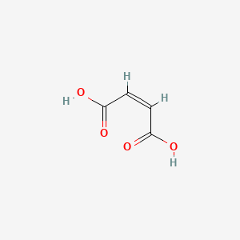

Maleic Acid

### Chemical formula  C4H4O4
### Molar mass  116.072 g·mol−1
### Appearance  White solid
### Density 1.59 g/cm3 
### Melting point 135 °C (275 °F; 408 K) (decomposes)
### Solubility in water 478.8 g/L at 20 C
### Acidity (pKa) pka1 = 1.90 pka2 = 6.07 
### Magnetic susceptibility (χ) -49.71·10−6 cm3/mol

* Cleaning products and household care \-\> bathroom \-\> bathroom cleaner  
* Cleaning products and household care \-\> general household cleaning \-\> bleach  
* Buffering  
* Foamant  
* Personal care \-\> dental care \-\> teeth whitener  
* Personal care \-\> hair styling and care \-\> shampoo  
* foaming agent-acid  
* fragrance ingredient  
* Used to make alkyd and polyester resins, surface coatings, lubricant additives, plasticizers, copolymers, drugs, and agricultural chemicals; Also used to retard rancidity of oils and to dye and finish textiles (wool, cotton, and silk)  
* Permitted for use as an inert ingredient in non-food pesticide products; \[EPA\] Used as a processing aid foods; \[FDA\] Used for foam control; \[Emerald Performance Materials MSDS\]  
* Manufacture of artificial resins; to retard rancidity of fats and oils in 1:10,000 (these are said to keep 3 times longer than those without the acid); dyeing and finishing wool, cotton, and silk; preparing the maleate salts of antihistamines and similar drugs.  
* Organic synthesis (malic, succinic, aspartic, tartaric, propionic, lactic, malonic and acrylic acids); dyeing and finishing of cotton, wool and silk; preservative for oils and fats.  
* Maleic anhydride, maleic acid, and fumaric acid are multifunctional chemical intermediates that find applications in nearly every field of industrial chemistry.  
* Coumarin is formed by reaction of phenol with malic, maleic, or fumaric acids in the presence of concentrated sulfuric acid.  
* This is an endogenously produced metabolite found in the human body. It is used in metabolic reactions, catabolic reactions or waste generation.  
 ##  Methods of Manufacturing  
  * Prepared by the catalytic oxidation of benzene over vanadium pentoxide.  
  * Vapor-phase oxidation of n-butane or n-butylene in air over a solid catalyst.  
  * Maleic acid is produced by the hydration of maleic anhydride.