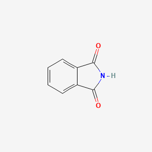

Phthalimide

### It is solid in nature and white in colour.
### The molar mass of the compound is 147.33 g/mol.
### Phthalimide melting point is 238℃ and the boiling point is 336℃.
### It is acidic in nature with a pKa value of 8.3.
### It is resonance stabilized.
### It is an imide derivative and has a heteroatom present in it.
### When it is reacted with base, it results in the formation of salts.
### The reason for high acidity is the presence of two electrophilic carbonyl groups.

* Used to make dyes, primary amines, amino acids, and Folpet (fungicide); Also used as a fungicide, laboratory reagent, and inhibitor of oxidation and photochemical reactions  
* Farming (Pesticides)  
* IN PRODUCTION OF PHTHALOCYANINE DYES  
* IN SYNTHESIS OF PRIMARY AMINES & AMINO ACIDS IN FORM OF ITS SODIUM OR POTASSIUM SALT  
* SYNTHETIC INDIGO, VIA ANTHRANILIC ACID; FUNGICIDE; ORGANIC SYNTHESIS; LABORATORY REAGENT  
* CHEM INT FOR PRIMARY AMINES, AMINO ACIDS, DYES, EG INDIGO, & FOLPET (A FUNGICIDE)  
* INHIBITOR FOR OXIDATION AND PHOTOCHEMICAL REACTIONS  
* Methods of Manufacturing  
* REACTION OF PHTHALIC ANHYDRIDE WITH AMMONIUM HYDROXIDE OR UREA  
* FROM PHTHALIC ANHYDRIDE & NH4OH OR (NH4)2CO3.