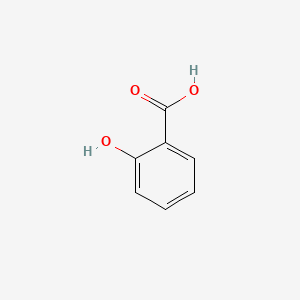

Salicylic Acid

### Salicylic acid is a colourless, odourless and needle-shaped crystals at room temperature.
### The taste of salicylic acid is acrid.
### The boiling point and melting point of salicylic acid are 211oC and 315oC respectively.
### The salicylic acid molecule has two hydrogen bond donors and three hydrogen bond acceptors.
### The flashpoint of salicylic acid is 157oC.
### Salicylic acid is soluble in organic solvents like carbon tetrachloride, benzene, propanol, ethanol and acetone.
### The density of salicylic acid is 1.44 at 20oC.
### Its vapour pressure is 8.2×105mmHg at 25oC.
### It is a tendency to undergo discolouration when exposed to direct sunlight due to its photochemical degradation.
### Upon degradation, it emits irritating fumes and acrid smelling smoke.
### Its heat of combustion is3.026mj/mole at 25oC.
### The pH of a saturated solution of salicylic acid is 2.4.
### Its pka value i.e., dissociation constant is 2.97.

| Arts and crafts/office supplies \-\> home office \-\> pens and markers |

| Cleaning products and household care \-\> air freshener |

| Cleaning products and household care \-\> bathroom \-\> bathroom cleaner |

| Cleaning products and household care \-\> dishwasher and dishes \-\> dish soap |

| Cleaning products and household care \-\> general household cleaning \-\> disinfectant |

| Cleaning products and household care \-\> laundry and fabric treatment \-\> laundry starch |

| Home maintenance \-\> adhesives and adhesive removers \-\> multipurpose adhesive |

| Home maintenance \-\> caulk/sealant |

| Laboratory supplies |

| Personal care \-\> acne treatment |

| Personal care \-\> acne treatment \-\> acne spot treatment |

| Personal care \-\> acne treatment \-\> face scrub |

| Personal care \-\> acne treatment \-\> face wash |

| Personal care \-\> body hygiene \-\> body wash |

| Personal care \-\> body hygiene \-\> feminine hygiene |

| Personal care \-\> body hygiene \-\> hand sanitizer |

| Personal care \-\> body hygiene \-\> hand soap |

| Personal care \-\> body powder |

| Personal care \-\> child specific \-\> baby lotion |

| Personal care \-\> child specific \-\> baby shampoo |

| Personal care \-\> deodorant |

| Personal care \-\> eye care and contacts \-\> eye cream |

| Personal care \-\> facial cleansing and moisturizing |

| Personal care \-\> facial cleansing and moisturizing \-\> face cleansing wipes |

| Personal care \-\> facial cleansing and moisturizing \-\> face cream/moisturizer |

| Personal care \-\> facial cleansing and moisturizing \-\> face mask |

| Personal care \-\> facial cleansing and moisturizing \-\> face scrub |

| Personal care \-\> facial cleansing and moisturizing \-\> face wash |

| Personal care \-\> fragrance |

| Personal care \-\> general moisturizing \-\> hand/body lotion |

| Personal care \-\> hair styling and care |

| Personal care \-\> hair styling and care \-\> hair conditioner |

| Personal care \-\> hair styling and care \-\> hair conditioner \- leave-in |

| Personal care \-\> hair styling and care \-\> hair conditioning treatment |

| Personal care \-\> hair styling and care \-\> hair spray |

| Personal care \-\> hair styling and care \-\> hair styling |

| Personal care \-\> hair styling and care \-\> scalp treatment |

| Personal care \-\> hair styling and care \-\> shampoo |

| Personal care \-\> hair styling and care \-\> shampoo \- dandruff |

| Personal care \-\> make-up and related \-\> blush/bronzer |

| Personal care \-\> make-up and related \-\> eye liner |

| Personal care \-\> make-up and related \-\> eye shadow |

| Personal care \-\> make-up and related \-\> foundation/concealer |

| Personal care \-\> make-up and related \-\> lip balm |

| Personal care \-\> make-up and related \-\> lip color |

| Personal care \-\> make-up and related \-\> toner |

| Personal care \-\> nails \-\> nail polish |

| Personal care \-\> self-tanner |

| Personal care \-\> shaving and hair removal \-\> aftershave |

| Personal care \-\> shaving and hair removal \-\> shaving cream |

| Personal care \-\> sunscreen |

| Pet care \-\> all pets \-\> other pet treatments |

| Pet care \-\> all pets \-\> pesticide \- pet |

| Pet care \-\> all pets \-\> pet shampoo |

| Pet care \-\> cats |

| Raw materials |

| active ingredient |

| antiacne active |

| antiacne agent |

| antidandruff |

| antidandruff agent |

| cleaning agent |

| cleaning agent, humectant |

| corn/callus/wart remover |

| denaturant |

| exfoliant |

| flavoring and nutrient |

| flavouring |

| fragrance |

| fragrance component |

| fragrance ingredient |

| hair conditioning |

| hair conditioning agent |

| hardener |

| humectant |

| keratolytic |

| kerotic agent |

| masking |

| skin conditioning |

| skin-conditioning agent \- miscellaneous |

| softener and conditioner |

| solvent |

* Source: bark of the white willow and wintergreen leaves; also produced by organic synthesis; Used medicinally for its bacteriostatic, fungicidal, and keratolytic properties; the salts are used as analgesics (aspirin)  
* Salicylic acid is used mainly in the synthesis of acetylsalicylic acid, the most commonly dispensed pharmaceutical product. In the form of esters, amides, and salicylic acid salts it serves as a starting material for other pharmaceutical products. Technical-grade salicylic acid is used primarily as an intermediate in the production of agrochemical products, dyes, and colorants, as well as in the rubber industry and in the manufacture of phenolic resins.  
* In the manufacture of aspirin, methyl salicylate, and other salicylates. Coupling agent for azo dyes. Has been used as food preservative. Keratolytic. Sodium salt as anti-inflammatory, analgesic, antipyretic.  
* Manufacture of resins, prevulcanization inhibitor, analytical reagent, /formerly as a/ fungicide  
* Acanthosis nigricans can be dealt with by using lotions or creams containing salicylic acid  
* Key additive in many skin-care products for the treatment of acne, psoriasis, callouses, corns, keratosis pilaris and warts.  
* Acanthosis nigricans can be dealt with by using lotions or creams containing salicylic acid  
* Methods of Manufacturing  
* Salicylic acid is prepared on an industrial scale by the Kolbe-Schmitt synthesis from dry sodium phenoxide in a stream of carbon dioxide at 150-160 °C and a pressure of 5 bar. The use of pressure results in a yield of about 90%, whereas without pressure the yield does not exceed 50% because disodium salicylate and phenol are formed in equivalent amounts.  
* Technical-grade salicylic acid obtained from the Kolbe-Schmitt process is already extremely pure: salicylic acid content 99.5%; phenol, p-hydroxybenzoic acid, or 4-hydroxyisophthalic acid 0.05 \- 0.1% (as impurity); ash \< 0.1%; water 0.2%. An even higher quality acid (pharmaceutical grade) can be obtained by crystallizing the sodium salicylate from water at a temperature not exceeding 20 °C, or by sublimation of the acid at 20 mbar and a temperature of 154 °C or with the aid of a carrier gas. A more modern process achieves sublimation directly by utilizing the heat of neutralization from the reaction of sodium salicylate with hydrogen chloride.  
* REACTION OF DRY, POWDERED SODIUM PHENATE WITH EXCESS CARBON DIOXIDE TO PRODUCE SODIUM SALICYLATE SOLUTION, WHICH IS ACIDIFIED TO OBTAIN SALICYLIC ACID  
* Manufactured by heating sodium phenolate with carbon dioxide under pressure.  
* SOME IS  MADE BY SAPONIFYING CERTAIN NATURAL OILS SUCH AS BIRCH OR GAULTHERIA.  