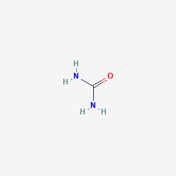

Urea (CO(NH₂)₂)

### Molar mass: 60.06 g/mol.
### Appearance: Colorless to white crystalline solid.
### Density: 1.32 g/cm³.
### Melting point: 134°C.
### Solubility: Easily soluble in water and alcohol.
### Odor: Odorless.
### Insoluble in ethane.
### Weak base.

| Cleaning products and household care \-\> dishwasher and dishes \-\> dish soap |

| Cleaning products and household care \-\> drain products |

| Cleaning products and household care \-\> general household cleaning \-\> disinfectant |

| Cleaning products and household care \-\> laundry and fabric treatment \-\> laundry detergent |

| Construction and building materials |

| Electronics/small appliances \-\> computers and accessories/supplies \-\> printer ink |

| Furniture and furnishings |

| Home maintenance \-\> paint/stain and related products \-\> paint |

| Home maintenance \-\> septic system |

| Landscape/yard \-\> herbicide |

| Landscape/yard \-\> lawn fertilizer |

| Landscape/yard \-\> plants and garden \-\> garden fertilizer |

| Manufactured formulations \-\> Flame retardants |

| Other indirect contact consumer goods |

| Personal care |

| Personal care \-\> body hygiene \-\> body wash |

| Personal care \-\> body hygiene \-\> hand soap |

| Personal care \-\> dental care \-\> toothpaste |

| Personal care \-\> deodorant |

| Personal care \-\> facial cleansing and moisturizing \-\> face cream/moisturizer |

| Personal care \-\> facial cleansing and moisturizing \-\> face mask |

| Personal care \-\> foot care |

| Personal care \-\> general moisturizing \-\> hand/body lotion |

| Personal care \-\> hair styling and care \-\> hair conditioner |

| Personal care \-\> hair styling and care \-\> hair conditioner \- leave-in |

| Personal care \-\> hair styling and care \-\> hair spray |

| Personal care \-\> hair styling and care \-\> shampoo |

| Personal care \-\> make-up and related \-\> lip balm |

| Personal care \-\> make-up and related \-\> lip liner |

| Personal care \-\> shaving and hair removal \-\> depilatory |

| Personal care \-\> specialized bath products \-\> bubble bath |

| Pesticides \-\> insecticide |

| Pet care \-\> all pets \-\> other pet treatments |

| Pet care \-\> fish |

| Raw materials |

| Specialty occupational products \-\> Firefighting foam |

| Vehicle \-\> engine maintenance \-\> auto fluids and additives |

| antistatic / humectant / skin conditioning |

| antistatic agent |

| binder component |

| board |

| buffering agent |

| builder |

| chelating agent |

| door leaf, bottom rail, top rail: thin mdf |

| flame retardant |

| formaldehyde scavenger |

| fragrance component |

| freeze-thaw stability |

| humectant |

| hydrotrope |

| pH regulating agent |

| particleboard core component |

| reagent |

| scavenger |

| skin conditioning agent |

| skin-conditioning agent \- humectant |

| softener and conditioner |

| solubility enhancer |

* A compound (CO(NH2)2), formed in the liver from ammonia produced by the deamination of amino acids. It is the principal end product of protein catabolism and constitutes about one half of the total urinary solids. \[ChemIDplus\] Used as a mordant in textile dyeing; \ Used to make fertilizer, feed additives, urea-formaldehyde resins and pharmaceuticals; Humans excrete 20-35 grams per day and have blood levels of 200-400 mg/L.  
* Condensed with malonic ester to form barbituric acid; cellulose softener.  
* LIQUID & OTHER FERTILIZER APPLICATIONS; LIVESTOCK NUTRIENT; MONOMER FOR UREA-FORMALDEHYDE RESINS; CHEMICAL INTERMEDIATE FOR MELAMINE  
* Urea is a decomposition inhibitor for ammonium perchlorate  
* Urea is reacted with alcohols to form alkylcarbamates  
* Urea is reacted with fatty acids from coconut oil to produce amides in 90% yields  
* Urea is used with zinc formaldehyde sulfoxylate to remove permanent hair dye  
* Urea is reacted with alpha-diketones or dialdehydes to form hydantoins  
* Urea is used to partially reverse the methylolamine chain reaction in glue gellation processes  
* Concentrated urea solutions are used to promote the rate of reaction between reactive dyes and wools  
* Ammonolysis of urea and ammonium thiocyanate produces guanidine  
* Urea is used as a deicing compound on airport runways  
* Animal feed; plastics; chemical intermediate; stabilizer in explosives; medicine (diuretic); adhesives; separation of hydrocarbons (as urea adducts); pharmaceuticals; cosmetics; dentifrices; sulfamic acid production; flameproofing agents; viscosity modifier for starch or casein-based paper coatings; preparation of biuret.  
* Widely used in solid and liquid complex fertilizers and for direct application. It is used in foliar sprays with or without the addition of pesticides and micronutrients.  
* Partially polymerized resins of urea are used by the textile industry to impart permanent-press properties to fabrics.  
* As urea-formaldehyde resins, urea-clathrates in petroleum-refining industry for production jet aviation fuels, and for dewaxing aviation fuels.  
* Urea is dehydrated and condensed to produce melamine  
* Urea is a building block for amino resins.  
* Methods of production  
*  from ammonia, carbon monoxide and sulfur in methanol.  
* Liquid ammonia and liquid carbon dioxide at 1750-3000 psi and 160-200 °C react to form ammonium carbamate, NH4CO2NH2, which decomposes at lower pressure (about 80 psi) to urea and water. Method of purification: crystallization.  
* Pure urea should not give the biuret reaction unless heated above melting point. In practice all reagent grade urea gives positive biuret reaction.  
* UREA, THE DIAMIDE OF CARBONIC ACID, IS MOST IMPORTANT DEGRADATION OF PROTEIN CATABOLISM IN MAN, IN OTHER MAMMALS & IN CERTAIN OTHER ANIMAL SPECIES. UREA IS FORMED IN LIVER & FORMS THE MAJOR PART OF ORGANICS IN URINE.