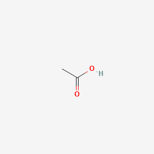

Acetic Acid

### Chemical formula  CH3COOH
### Molar mass  60.052 g·mol−1
### Appearance:  Colourless liquid
### Odor:  Heavily vinegar-like
### Density: 1.049 g/cm3 (liquid); 1.27 g/cm3 (solid)
### Melting point: 16 to 17 °C; 61 to 62 °F; 289 to 290 K
### Boiling point: 118 to 119 °C; 244 to 246 °F; 391 to 392 K
### Solubility in water: Miscible
### Vapor pressure  1.54653947 kPa (20 °C), 11.6 mmHg (20 °C)
### Acidity (pKa): 4.756
### Conjugate base:  Acetate

| Arts and crafts/office supplies \-\> general arts and crafts supplies \-\> arts and crafts adhesive 

| Arts and crafts/office supplies \-\> general arts and crafts supplies \-\> arts and crafts finish 

| Cleaning products and household care |

| Cleaning products and household care \-\> air freshener |

| Cleaning products and household care \-\> carpet and floor |

| Cleaning products and household care \-\> dishwasher and dishes |

| Cleaning products and household care \-\> general household cleaning |

| Cleaning products and household care \-\> general household cleaning \-\> bleach |

| Cleaning products and household care \-\> general household cleaning \-\> glass cleaner |

| Cleaning products and household care \-\> laundry and fabric treatment |

| Cleaning products and household care \-\> laundry and fabric treatment \-\> laundry starch |

| Cleaning products and household care \-\> lime remover |

| Construction and building materials |

| Electronics/small appliances \-\> computers and accessories/supplies \-\> printer toner |

| Home maintenance \-\> adhesives and adhesive removers \-\> multipurpose adhesive |

| Home maintenance \-\> caulk/sealant |

| Home maintenance \-\> paint/stain and related products \-\> paint |

| Home maintenance \-\> paint/stain and related products \-\> stripper |

| Laboratory supplies |

| Landscape/yard \-\> plants and garden \-\> garden fertilizer |

| Personal care \-\> body hygiene \-\> body wash |

| Personal care \-\> body hygiene \-\> feminine hygiene |

| Personal care \-\> eye care and contacts |

| Personal care \-\> hair styling and care \-\> shampoo |

| Personal care \-\> sexual wellness |

| Pesticides \-\> insect repellent |

| Pet care \-\> all pets \-\> other pet treatments |

| Raw materials |
| acid |
| acidifiers |
| admixture ingredient |
| antimicrobial agent |
| biocide |
| buffering |
| buffering agent |
| chelating agent |
| chemicals added that influence or buffer ph |
| cleaning agent |
|  |
| complexing/sequestering agent |
| contaminant |
| flavor enhancer |
| flavoring agent or adjuvant |
| fragrance component |
| fragrance ingredient |
| iron control |
| masking |
| pH adjustment |
| pH control |
| refining agents (must be eliminated during process of manufacturing) |

* Used to manufacture acetic anhydride and other organic chemicals used in the plastic, pharmaceutical, dye, insecticide, textile, rubber, and photographic industries; \[ACGIH\] Used in photography (stop bath); \ Used as a wet etchant in semiconductor manufacturing at standard concentrations of 36% or 99.5%; \[CSH, p. 46\] Used in the bating and tanning stages of leather production

* Semiconductor Manufacturing   
* Textiles (Fiber & Fabric Manufacturing)   
* Leather Tanning and Processing   
* Photographic Processing   
* Textiles (Printing, Dyeing, or Finishing)   
* Burning Natural Polymers   
* Burning Synthetic Polymers   
* Sculpturing plastics   
* Textile arts   
* Smoking cigarettes   
* Applying metallic patinas   
* Burning biomass fuel for cooking and heating  
* Used as a laboratory reagent in chemical and biochemical analysis, in field testing of lead fumes, vinyl chloride determination, uric acid in urine, aniline vapors, and separation of gases. Used in miscellaneous applications for etching compounds for engraving; deliming agent during leather tanning, solvent for organic compounds, and oil well acidizer.  
* Used in chemical industry ... as an acidifying and neutralizing agent. Used in canning industries as an additive or flavorant for pickles, fish, meat, candy, and glazes ... used in textile and dye industries as ... dye catalysts, textile finishing, dye after-treatment, and production of nylon and acrylic fibers.  
* Constituent of photographic fixing baths, hardeners, hypotest solutions, and constituent of microfilm cements.  
* Acetic acid gives vinegar its sour taste and pungent smell. It is an important chemical reagent and industrial chemical, used in the plastic, pharmaceutical, dye, insecticide, textile, rubber, and photographic industries. Water-free acetic acid (glacial acetic acid) is used in the production of certain fragrances. (L1885) Used to treat infections in the ear canal.  
  Methods of Manufacturing  
* The major routes for synthetic acetic acid include methanol carbonylation, acetaldehyde oxidation, butane/naphtha oxidation, and methyl acetate carbonylation. Comparatively small amounts are generated by butane liquid-phase oxidation, direct ethanol oxidation, and synthesis gas.  
* Obtained in the destructive distillation of wood; from acetylene and water, via acetaldehyde by oxidation with air.  
* Liquid- and vapor-phase oxidation of petroleum gases (with catalyst); ... oxidation of acetaldehyde; ... reaction of methanol and carbon monoxide (with catalyst; this is the most cost efficient method and has been in general use for some years); ... fermentative oxidation of ethanol.  
* Acetaldehyde (air oxidation): acetaldehyde + oxygen (Hoechst-Shawinigan process; coproduced with acetic anhydride): acetaldehyde (air oxidation; coproduced with peracetic acid): methanol + carbon monoxide (BASF/Monsanto carbonylation processes): methanol + carbon monoxide (BP acetyls process; coproduced with acetic anhydride): naphtha, heavy (liquid-phase oxidation; coproduced with acetone/methyl ethyl ketone/formic acid/propionic acid): n-butane (Celanese LPO process; coproduced with methanol/ethanol/acetone/methyl ethyl ketone/formic acid/propionic acid/n-butyric acid/methyl formate): acetic anhydride + cotton linters/bleached wood pulp (acetylation/partial hydrolysis; byproduct of cellulose acetate production)