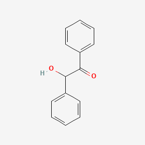

Benzoin

### Chemical formula    C14H12O2
### Molar mass  212.248 g·mol−1
### Appearance  Off-white crystals
### Density 1.310 g/cm3 (20 °C)
### Melting point   135 to 139°C (275 to 282 °F; 408 to 412 K)
### Boiling point   330 to 356 °C (626 to 673 °F; 603 to 629 K)
### Solubility in water Slightly soluble
### Solubility in ethanol   Very good
### Solubility in ether Slightly soluble
### Solubility in chlorine  Soluble
### Solubility in chloroform    Very good

| Furniture and furnishings |

| Personal care \-\> dental care |

| Personal care \-\> fragrance |

| Personal care \-\> make-up and related \-\> lip balm |

| additive |

| flavouring |

| fragrance |

| fragrance component |

| powder paint Plasticizer Paint additives and coating additives not described by other categories Not Known or Reasonably Ascertainable Aerating and deaerating agents Surfactant (surface active agent) |

* Used as a flavor, antiseptic, photopolymerization catalyst, and in organic syntheses  
* Using Disinfectants or Biocides  
* principly as a flavor ingredient; antiseptic; photopolymerization catalyst; int for alpha-benzoin oxime (analyt reagent for metals), wetting agents, emulsifying agents, stilbestrol products  
* used (a lot) in organic syntheses  
* Methods of Manufacturing  
* Reaction of potassium cyanide and benzaldehyde (benzoin condensation)  
* Prepd by treating an alcoholic soln of benzaldehyde with an alkali cyanide: adams, marvel, org syn vol 1, page 33 (1921); coll vol i, 88; arnold, fuson, j am chem soc 58, 1295 (1936); lf fieser, organic experiments (dc health & co, boston, 1964), pages 211-214.  