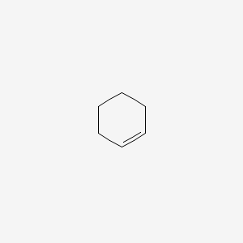

Cyclohexene 
 
### Chemical formula  C6H10
### Molar mass  82.143 g/mol
### Appearance  colorless liquid
### Odor:  sweet
### Density 0.8110 g/cm3
### Melting point −103.5 °C (−154.3 °F; 169.7 K)
### Boiling point 82.98 °C (181.36 °F; 356.13 K)
### Solubility in water: slightly soluble in water
### Solubility:  miscible with organic solvents
### Vapor pressure:  8.93 kPa (20 °C) 11.9 kPa (25 °C)

* Used in organic synthesis and as a solvent for oil extraction and catalysts; \[ACGIH\]  
* Petroleum Production and Refining.  
* ALKYLATION COMPONENT; IN MFR OF ADIPIC ACID, MALEIC ACID, HEXAHYDROBENZOIC ACID AND ALDEHYDE. TO PREPARE BUTADIENE IN THE LABORATORY.  
* Catalyst solvent; oil extraction.  
* Cyclohexene is used as stabilizer for high octane gasoline.  
* Used in the preparation of butadiene in lab ... Inorganic synthesis.  
* Cyclohexene is used as an intermediate for the production of cyclohexanol and cyclohexeneoxide, and as a specific solvent.

Methods of Manufacturing

* Cyclohexene is prepared by dehydration of cyclohexanol by thermal reaction of a ethylene-propylene-butadiene mixture.  
* Prepared by dehydration of cyclohexanol at high temps over various catalysts.  
    
  * In Japan, cyclohexene is synthesized in a closed system by catalytic hydrogenation of benzene, isolated by fractionation, stored temporarily in storage tanks and used solely as an intermediate for cyclohexanol synthesis in the same factory. Workers take quality control samples of fractionated cyclohexene once a day and stored cyclohexene once a month. ... Workers wear goggles and protecting gloves during sampling, exposure through dermal contact is therefore expected to be minimal.

Identification

* MONITORING METHOD: ANALYTE: CYCLOHEXENE; MATRIX: AIR; RANGE: 510-2030 MG/CU M; PROCEDURE: ADSORPTION ON CHARCOAL, DESORPTION WITH CARBON DISULFIDE, GAS CHROMATOGRAPHY.