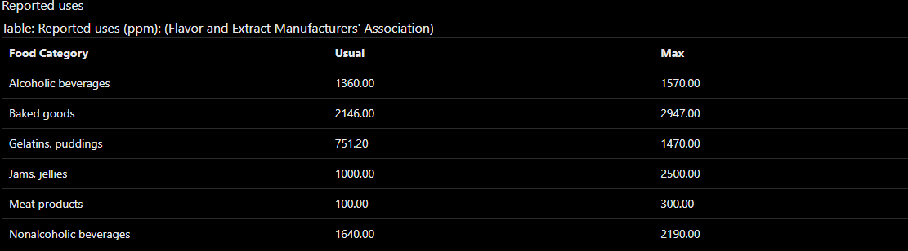

Fumaric Acid

* Cleaning and safety  
* Category Description: Products used for cleaning or safety in an occupational or industrial setting (e.g. industrial cleaning supplies or laundry detergent, eye wash, spill kits)  
* buffering  
* curing accelerators (must be used only in combination with curing agents)  
* dispersing agent  
  * flavouring  
  * fragrance ingredient  
  * pH regulating agent  
* An essential biochemical in the cellular respiration of plants and animals; \[Merck Index\] Used as a fortifier (paper size resins, unsaturated polyester resins, and alkyd surface coating resins), food antioxidant, dye mordant, and medication; Also used in dentifrices (stain remover) and to make other chemicals; \[HSDB\] Used in rosin esters and adducts, drying oils, printing inks, and foods (acidulant and flavoring agent)  
* Pulp and Paper Processing \[Category: Industry\]  
* Painting (Pigments, Binders, and Biocides) \[Category: Paint\]  
* Textiles (Printing, Dyeing, or Finishing) \[Category: Industry\]  
* Permitted for use as an inert ingredient in non-food pesticide products; \[EPA\] Used as a processing aid foods; \[FDA\] Used for foam control; \[Emerald Performance Materials MSDS\]  
* Fumaric acid is used primarily in liquid pharmaceutical preparations as an acidulant and flavoring agent. Fumaric acid may be included as the acid part of effervescent tablet formulations, although this use is limited as the compound has an extremely low solubility in water. It is also used as a chelating agent which exhibits synergism when used in combination with other true antioxidants. In the design of novel pelletized formulations manufactured by extrusion-spheronization, fumaric acid was used to aid spheronization, favoring the production of fine pellets. It has also been investigated as an alternative filler to lactose in pellets. Fumaric acid has been investigated as a lubricant for effervescent tablets, and copolymers of fumaric acid and sebacic acid have been investigated as bioadhesive microspheres. It has also been used in film-coated pellet formulations as an acidifying agent and also to increase drug solubility. Fumaric acid is also used as a food additive at concentrations up to 3600 ppm, and as a therapeutic agent in the treatment of psoriasis and other skin disorders.  
* 

* Fortifier in paper size resins, unsaturated polyester resins, and alkyd surface coating resins; miscellaneous applications; acidulant in gelatin desserts and dry beverage powders; chemical intermediate for plasticizers including dibutyl fumarate.  
    
*   
  * Fumaric acid is naturally produced by the body, however for industrial applications it is synthesized chemically. Fumaric acid is used to impart a tart taste to processed foods. It is also used as an antifungal agent in boxed foods such as cake mixes and flours, as well as tortillas. Fumaric acid is also added to bread to increase the porosity of the final baked product. It is used to impart a sour taste to sourdough and rye bread. In cake mixes, it is used to maintain a low pH and prevent clumping of the flours used in the mix. In fruit drinks, fumaric acid is used to maintain a low pH which, in turn, helps to stabilize flavor and color. Fumaric acid also prevents the growth of E. coli in beverages when used in combination with sodium benzoate. When added to wines, fumaric acid helps to prevent further fermentation and yet maintain low pH and eliminate traces of metallic elements. In this fashion, it helps to stabilize the taste of wine. Fumaric acid can also be added to dairy products, sports drinks, jams, jellies and candies. Fumaric acid helps to break down bonds between gluten proteins in wheat and helps to create a more pliable dough. Fumaric acid is used in paper sizing, printer toner, and polyester resin for making molded walls.

Methods of Manufacturing

* Commercially, fumaric acid may be prepared from glucose by the action of fungi such as Rhizopus nigricans, as a by-product in the manufacture of maleic and phthalic anhydrides, and by the isomerization of maleic acid using heat or a catalyst. On the laboratory scale, fumaric acid can be prepared by the oxidation of furfural with sodium chlorate in the presence of vanadium pentoxide.  
    
* Maleic acid or maleic anhydride, especially the maleic acid-containing wash water from the production of maleic anhydride or phthalic anhydride, serves as starting material for the manufacture of fumaric acid. The maleic acid concentration should be at least 30%. Maleic acid is converted almost quantitatively by thermal or catalytic isomerization into the sparingly soluble fumaric acid, which is recovered by filtration. Various substances have been proposed as catalysts: mineral acids (e.g., hydrochloric acid); sulfur compounds such as thiocyanates, thiazoles, thiosemicarbazides, thioureas; or bromine compounds in combination with peroxides (e.g., persulfate). Thiourea is most commonly used in practice. The maleic acid-containing wash water contains impurities that can affect quality and yield. This problem can be largely avoided (1) by thermal pretreatment of the wash water, (2) by adding urea if thiourea is used as catalyst, and (3) by addition of sulfites or passaged of sulfur dioxide and addition of mineral acids. The crude fumaric acid obtained is purified by recrystallization from water, combined with purification by active charcoal. Losses during purification are about 10%.