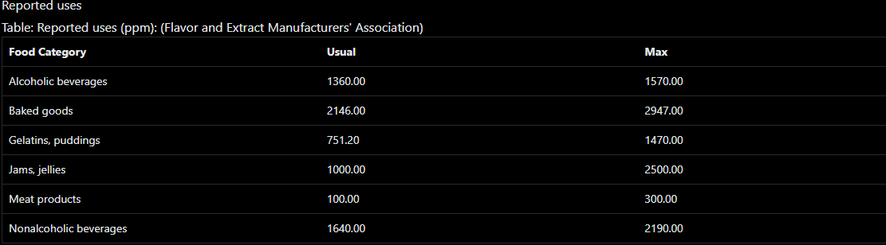

Iso Amyl Acetate

* Cleaning and safety  
* Cleaning products and household care \-\> air freshener  
* Cleaning products and household care \-\> bathroom \-\> bathroom cleaner  
* Flavoring  
* Fragrance  
* Used as an additive to aerosols and cosmetics and to fit-test respirators  
* In alcohol solutions as a pear/banana flavor in mineral waters and syrups; as solvent for old oil colors, for tannins, nitrocellulose, lacquers, celluloid and camphor; swelling bath sponges; covering unpleasant odors, perfuming shoe polish; manufacturing artificial silk, leather, or pearls, photographic films, celluloid cements, waterproof varnishes, bronzing liquids, and metallic paints; dyeing and finishing textiles. A special grade of the amyl acetate has been used for burning in the Hefner lamp serving as a photometric standard.  
* Industrial uses of amyl acetate include the following: ... as a warning odor; in the manufacture of ... artificial glass, and straw hats  
* solvent for nitrocellulose, masking undesirable odors.  
* In the manufacture of acetic acid by direct oxidation of a petroleum-based feedstock, solvent extraction has been used to separate acetic acid from the aqueous reaction liquor containing significant quantities of formic and propionic acids. Isoamyl acetate is used as solvent to extract nearly all the acetic acid, and some water, from the aqueous feed. The extract is then dehydrated by azeotropic distillation using isoamyl acetate as water entrainer.  
* Used in making smokeless powder, airplane dopes, dry cleaning compounds.  
*  
* Due to its strong smell, which can be perceived already at low concentrations, and because of supposedly low toxicity, /isoamyl acetate/ IAA is used to test the effectiveness of respirators or gas masks.  
* It is the main component of banana aroma and is, therefore, also used in banana flavors.  
* Repellent against dogs and cats for ornamental vegetation .... Insecticides and miticides to combat wasps and bees.

Methods of Manufacturing

* Usually prepared by esterification of commercial isoamyl alcohol with acetic acid.  
* Rectification of commercial amyl acetate.