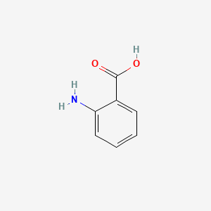

Ortho Amino Benzoic Acid (Anthranilic acid)
 
### Density  1.383 g/cm3 (23 °C)
### Flash point 150 °C
### Ignition temperature  >530 °C
### Melting Point 145 °C
### Vapor pressure  0.001 hPa (52.6 °C)
### Bulk density  500 kg/m3
### Solubility  4.5 g/l

 
* Dyes  
* Intermediate  
* Pigments  
* Used as an intermediate for dyes, drugs, pesticides, perfumes, flavors, and bird and insect repellents; Also used as a mold inhibitor in soya sauce and to enhance the milk production in cows; \[HSDB\]  
* Farming (Feed Additives)  
* Dyes, drugs, perfumes, and pharmaceuticals.  
* chem int for ci acid yellow 121, vat violet 13, vat blue 1, ci direct brown 112, mordant yellow, mordant red 9, mordant brown 40, & pigment red 60, & for its esters used in perfumes & fungicides, & in saccharin; cadmium salt- an ascaricide in swine; mold inhibitor in soya sauce  
* As mold inhibitor in soya sauce; its esters have found applications in perfumes, synthetic flavors, bird and insect repellents, as fungicides for syrups  
* THERAP CAT (VET): The cadmium salt has been used as an acaricide in swine  
* Enhances the milk production in cows. ... Intermediate for dyes. ... Intermediate for tranquilizers and antiphlogistics.  
* Naturally produced by the body (endogenous).  
  Methods of Manufacturing  
* prepared by fischer in 1896 by heating 2-nitrosobenzoic acid with aq ammonium sulfide @ 100 °c...produced commercially by hofmann reaction, in which phthalimide is reacted with sodium hypochlorite & caustic soda...  
* prepared by reduction of o-nitrobenzoic acid  
* treatment of phthalimide with an alkaline hypobromite soln.  
* 2-Aminobenzoic acid is usually made from phthalic anhydride via sodium phthalamate. Oxidative decarboxylation (the Hofmann reaction) is carried out by the addition of sodium hypochlorite solution at 60 \- 100 °C followed by acidification. The product is purified with activated carbon and bisulfite.