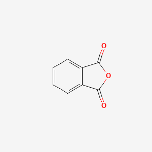

Phthalic anhydride

### Molar mass  148.1 g/mol
### Appearance  white flakes
### Odor    characteristic, acrid[2]
### Density 1.53 g/cm3, solid; 1.20 g/mL, molten[2]
### Melting point   131.6 °C (268.9 °F; 404.8 K)
### Boiling point   295 °C (563 °F; 568 K) sublimates
### Solubility in water 0.62 g/100g (20—25 °C);19.0 g/100g (100 °C);reacts slowly
### Vapor pressure  0.0015 mmHg (20 °C)[2]
### Magnetic susceptibility (χ) −67.31×10−6 cm3/mol

* Personal care \-\> nails \-\> nail polish  
* Pigment  
* Ion exchange agent  
* Polymerization promoter  
* Intermediate  
* Hardener  
* Plasticizer  
* Monomers  
* Rubber retarder  
* Phthalic anhydride is an important chemical intermediate in the plastics industry from which are derived numerous phthalate esters that function as plasticizers in synthetic resins. Phthalic anhydride itself is used as a monomer for synthetic resins such as glyptal, the alkyd resins, and the polyester resins. Phthalic anhydride is used in the synthesis of primary amines, the agricultural fungicide phaltan, and thalidomide. Other reactions with phthalic anhydride yield phenolphthalein, benzoic acid, phthalylsulfathiazole (an intestinal antimicrobial agent), and orthophthalic acid.  
* Chemical intermediate for various chemical resins, dyes, and pigments; curing agent for epoxy resins; \[HSDB\] Occupational asthma reported in plastic resin production workers; \[Malo\] Used to make alkyd resins in the production of paints; Workers may be exposed while welding on painted metals containing alkyd resin with phthalic anhydride hardener\[HSDB\]  
* Plastic Composites Manufacturing  
* Welding Over Coatings  
* Chem int for dioctyl phthalates-eg, di(2-ethylhexyl), other phthalate plasticizers-eg, dibutyl, insect repellents-eg, dimethyl phthalate, unsaturated polyester resins, alkyd resins, dyes and pigments, isatoic anhydride, halogenated phthalic anhydrides, diallyl phthalate, urethane polyester polyols, phenolphthalein; curing agent for epoxy resins.  
* Scorch inhibitor for rubber stocks.

Methods of Manufacturing

* Prepared from naphthalene by oxidation with a mixture of HgSO4 and CuSO4 in presence of H2SO4; by passing naphthalene and oxygen over a suitable catalyst at 400-500 °C.  
* /Commercial production by/ ... gas-phase oxidation of naphthalene or o-xylene in an air stream with vanadium oxide as catalyst.