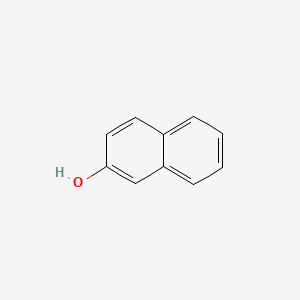

2-Naphthol  

### vapor density. 4.97 (vs air)
### vapor pressure. 10 mmHg ( 145.5 °C)
### Assay. 99%
### form. powder or flakes.
### bp. 285-286 °C (lit.)
### mp. 120-122 °C (lit.)
### solubility. methanol: soluble 1 g/10 mL, clear, colorless to light yellow.

* hair dyeing  
* intermediate substance in pigment production  
* perfuming  
* Electroplating \[Category: Plate\]  
* Painting (Pigments, Binders, and Biocides)   
* Using Disinfectants or Biocides   
* Leather Tanning and Processing   
* Textiles (Printing, Dyeing, or Finishing)   
* Used to make dyes, pigments, fungicides, insecticides, pharmaceuticals, and perfumes; Also used as antioxidants for rubber, fats, and oils; as an antiseptic; for lubrication of steam turbines, electric motors, hydraulic equipment, and instruments; and formerly as an anthelmintic; \[HSDB\] Also used as an additive in electroplating, developer in dyeing and printing of fabrics, in tanneries, and in the paints-lacquers-varnishes industry; \[IUCLID\]  
* The principal uses for 2-naphthalenol are in the dyes and pigments industries, eg, as a coupling component for azo dyes, and to make important intermediates, such as 3-hydroxy-2-naphthalenecarboxylic acid (BON) and its anilide (naphthol AS), 2-naphtholsulfonic acids, aminonaphtholsulfonic acids, and 1-nitroso-2-naphthol.  
* Antioxidants for ... fats, oils; insecticides; synthesis of fungicides; ... antiseptic.  
* Manufacturing medicinal organics, dyes, perfumes; the largest single use is probably in making antioxidants for the synthetic rubber industry.  
* Lubrication of steam turbines, electric motors, hydraulic equipment and instruments.  
* The major pharmaceutical products based on 2-naphthol are the antifungal tolnaftate, produced by reaction with thiophosgene and N-methyl-m-toluidine; the semisynthetic penicillin nafcillin, produced via 2-ethoxynaphthalene; and the antirheumatic naproxen, produced via 2-methoxynaphthalene.  
* 2-Naphthol ... has had medical uses as a counterirritant in alopecia, also as an anthelmintic, and as an antiseptic in treatment of scabies.  
* Methods of Manufacturing  
* 2-Naphthol is produced by caustic fusion of naphthalene-2-sulfonic acid. Typically, the sodium salt of the sulfonic acid is added gradually to 50% sodium hydroxide liquor at 300 °C; the melt is then heated further at 320 °C in a gas-fired iron vessel with vigorous agitation. After completion of the reaction, the melt is run into excess water, possibly including filtrate from the previous batch at a proven tolerable level, and the naphtholate solution is neutralized to pH 8 with dilute sulfuric acid. If the temperature is maintained at \>100 °C during neutralization, the crude product comes out of solution as an oil, which is separated, washed with hot water, and distilled under vacuum to give pure 2-naphthol. The molten material is processed through a flaker to give the final product for packaging. The fusion yield is about 80% of the theoretical value, resulting in an overall yield of 70% based on naphthalene.  
* Alkylation and isomerization are carried out up to 240 °C with a phosphoric acid catalyst. Final catalytic oxidation at 90 \- 110 °C gives the hydroperoxide, which is cleaved with dilute sulfuric acid to give 2-naphthol in high overall yield in spite of modest oxidation conversion.  
* By fusing sodium beta-naphthalene sulfonate with caustic soda. Product is distilled in vacuo and then sublimed.